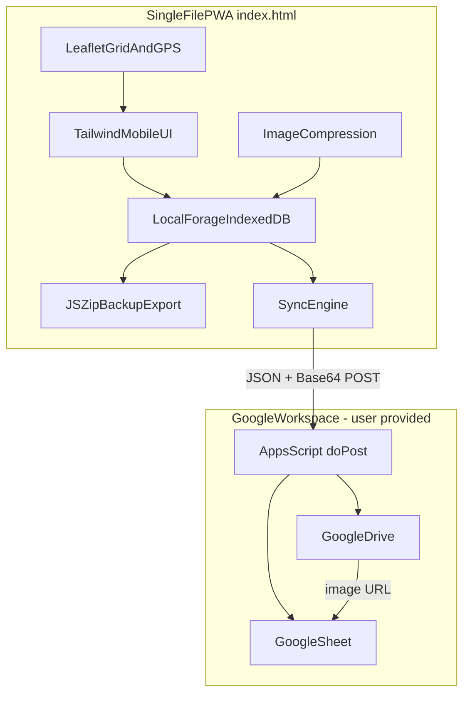
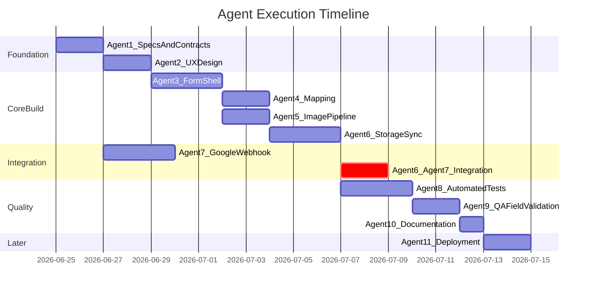

# Multi-Agent Plan: SCDNR Tag Logging PWA

## Current State

The workspace at [`/Users/adriaanlagaay/Documents/SCDNR Tag Logging Program`](/Users/adriaanlagaay/Documents/SCDNR%20Tag%20Logging%20Program) contains **specifications only** — five Word documents, zero source code:

| Document | Purpose |
|----------|---------|
| [Project Definition & Overview.docx](/Users/adriaanlagaay/Documents/SCDNR%20Tag%20Logging%20Program/Project%20Definition%20%26%20Overview.docx) | Mission, requirements, 12-field schema |
| [SCDNR Tagging Report Program.docx](/Users/adriaanlagaay/Documents/SCDNR%20Tag%20Logging%20Program/SCDNR%20Tagging%20Report%20Program.docx) | Full project brief (intended as `project_brief.md`) |
| [System Architecture & Technical Stack.docx](/Users/adriaanlagaay/Documents/SCDNR%20Tag%20Logging%20Program/System%20Architecture%20%26%20Technical%20Stack.docx) | Architecture, mapping, webhook pipeline |
| [Edge Cases, Error Handling & Data Resiliency.docx](/Users/adriaanlagaay/Documents/SCDNR%20Tag%20Logging%20Program/Edge%20Cases,%20Error%20Handling%20%26%20Data%20Resiliency.docx) | Offline, memory, purge rules |
| [End-User Onboarding & Operational Guide.docx](/Users/adriaanlagaay/Documents/SCDNR%20Tag%20Logging%20Program/End-User%20Onboarding%20%26%20Operational%20Guide.docx) | PWA install, field workflow, sync |

**Your constraints (confirmed):**
- Scaffold and build **locally first**; GitHub Pages deployment later
- You will **provide** Google Sheet, Drive folder, and Apps Script webhook URL

---

## Target Architecture



**Deliverable structure agents should create:**

```
SCDNR Tag Logging Program/
├── docs/
│   ├── project_brief.md          # converted from Word specs
│   ├── architecture.md
│   ├── onboarding-guide.md
│   └── qa-checklist.md
├── src/
│   └── index.html                # single-file PWA (or modular sections merged)
├── google-apps-script/
│   └── Code.gs                   # reference script for your deployed webhook
├── tests/
│   ├── unit/                     # pure JS logic tests
│   ├── integration/              # storage, sync mocks
│   └── e2e/                      # Playwright mobile scenarios
├── config/
│   └── config.example.js         # webhook URL placeholder
└── README.md
```

---

## Agent Roles and Responsibilities

### Agent 1 — Project Lead / Orchestrator

**Role:** Sequencing, contracts between agents, merge conflict resolution, acceptance gates.

**Tasks:**
1. Convert Word specs into canonical markdown in `docs/` (starting with `project_brief.md`)
2. Define shared contracts:
   - **Catch record JSON shape** (12 schema fields + `id`, `syncStatus`, `createdAt`, `gridCellId`, `photoBase64`)
   - **Sync payload format** for Apps Script `doPost`
   - **Config injection point** for webhook URL (you will paste real URL into `config.js`, gitignored)
3. Maintain a `AGENTS.md` handoff doc listing module ownership, file paths, and "done" criteria per phase
4. Run phase gates: no agent proceeds to integration until prior phase acceptance checklist passes

**Acceptance:** All five Word docs represented in markdown; contracts documented; folder scaffold exists.

---

### Agent 2 — UX / Frontend Design

**Role:** Mobile-first field UI for boat use (wet hands, glare, one-handed operation).

**Tasks:**
1. Produce a **design spec** (`docs/ui-design-spec.md`) covering:
   - Screen map: Catch Form, Sync Dashboard, Settings/About
   - Touch targets ≥ 48px; high-contrast outdoor palette (SCDNR-appropriate greens/blues)
   - Typography scale for readability on small phones
   - Component inventory: GPS button, species dropdown, photo capture, unsent counter badge, sync progress bar
2. Define **Tailwind class patterns** (no custom build — CDN only per spec)
3. Wireframe the **on-the-water workflow** from [End-User Onboarding doc](/Users/adriaanlagaay/Documents/SCDNR%20Tag%20Logging%20Program/End-User%20Onboarding%20%26%20Operational%20Guide.docx):
   - Launch → GPS capture → form → photo → Save Catch → form reset
   - Dock return → unsent count → Submit Sync / Download Backup ZIP
4. Design **error/empty states**: offline banner, GPS denied, sync failed, map tiles unavailable
5. Design **double-confirm modals** for destructive actions (clear queue)

**Deliverables:** `docs/ui-design-spec.md`, optional static HTML mockup section or annotated screenshots in `docs/wireframes/`

**Handoff to:** Agent 3 (implements markup/CSS)

---

### Agent 3 — Core PWA / Form Implementation

**Role:** Build the single-file app shell and 12-field data capture form.

**Depends on:** Agent 2 design spec, Agent 1 schema contract

**Tasks:**
1. Create [`src/index.html`](/Users/adriaanlagaay/Documents/SCDNR%20Tag%20Logging%20Program/src/index.html) with CDN imports:
   - Tailwind CSS, Leaflet, LocalForage, JSZip
2. Implement **12-field form** with strict validation per [Project Definition doc](/Users/adriaanlagaay/Documents/SCDNR%20Tag%20Logging%20Program/Project%20Definition%20%26%20Overview.docx):

   | Field | Control | Validation |
   |-------|---------|------------|
   | Tag Type | Radio/select | CR or K only |
   | Complete Tag # | Numeric input | Required |
   | Vial # | Text | Optional |
   | Date & Time | Auto timestamp | Read-only |
   | Species | Dropdown | No free text — confirm list with you if not in specs |
   | Length | Numeric | Required, inches |
   | Measurement Type | Radio | Tail / Fork |
   | Measurement Accuracy | Radio | Measured / Estimated |
   | Location Name | Text | Required |
   | Lat / Long | Auto from GPS/map | Required before save |
   | Fish Condition | Radio | Good / Fair / Poor |
   | Catch Photo | File/camera | Required, passes to compression pipeline |

3. **Save Catch** flow: validate → compress photo (Agent 5) → persist (Agent 6) → reset form → increment local counter
4. **PWA basics:** `manifest.json` inline or linked, meta tags for iOS standalone, service worker for offline shell (cache `index.html` + CDN assets where feasible)
5. **Sync Dashboard UI:** unsent count, Submit Sync button, Download Backup ZIP, progress indicator

**Acceptance:** Form saves valid records locally; invalid submissions blocked with inline errors; UI matches design spec.

---

### Agent 4 — Mapping & Spatial Engine

**Role:** Leaflet map, 1-mile grid, GPS, NOAA bathymetry toggle.

**Depends on:** Agent 3 shell (map container in DOM)

**Tasks:**
1. Initialize Leaflet centered on SC coast (~32.7°N, configurable default zoom)
2. **Dynamic 1-square-mile grid** using spec math:
   - Lat delta ≈ 0.0145° per mile
   - Lon delta ≈ 0.0172° per mile
   - Draw grid polygons for visible viewport; compute **grid cell ID** and **centroid** on cell click
3. **"Capture Current GPS Location"** button using `navigator.geolocation` — must work when map tiles fail to load (dead zone)
4. Map click fallback: set lat/long from clicked grid cell centroid
5. **Layer toggle:** standard tiles + NOAA ENC/bathymetric WMS (`L.tileLayer.wms` or equivalent public NOAA endpoint — verify URL at implementation time)
6. Populate lat/long/location fields from GPS or map interaction

**Acceptance:** GPS works with network disabled (tiles may be blank); grid click sets coordinates; layer toggle functional online.

---

### Agent 5 — Image Processing Pipeline

**Role:** Prevent browser OOM from 10–15MB camera photos.

**Tasks:**
1. Canvas pipeline: max width **800px**, JPEG quality **75%**, output Base64 string
2. Hook into photo input before LocalForage write
3. Enforce max stored image size (~150KB target per spec)
4. Handle EXIF orientation edge case on mobile uploads
5. Unit-testable pure functions in isolated module section (extracted inside `index.html` or `src/lib/image.js` merged in)

**Acceptance:** 12MB test image compresses to ≤200KB; no crash when saving 50+ records in test harness.

---

### Agent 6 — Offline Storage & Sync Engine

**Role:** LocalForage queue, sync orchestration, ZIP export, purge rules.

**Tasks:**
1. LocalForage config: store array of catch records keyed by UUID
2. **Offline save:** flag `syncStatus: 'pending'`; update unsent counter in UI
3. **Sync engine:**
   - Batch POST each pending record to user-provided webhook URL from `config.js`
   - On HTTP 200: mark synced, optionally remove from queue (per purge policy)
   - On failure: retain record, show "Ingest Failed — Try Again"
4. **Verified purge sequence** (from [Edge Cases doc](/Users/adriaanlagaay/Documents/SCDNR%20Tag%20Logging%20Program/Edge%20Cases,%20Error%20Handling%20%26%20Data%20Resiliency.docx)):
   - Never purge on export click alone
   - Purge only after confirmed HTTP 200 from webhook OR user confirms after verified ZIP download
5. **JSZip backup:** CSV (all 12 fields) + image files per record; trigger browser download
6. **Double-confirm modal** before manual clear

**Acceptance:** Records survive app reload; sync retries work; purge blocked until success conditions met.

---

### Agent 7 — Backend Integration (Google Apps Script)

**Role:** Reference webhook script aligned with your existing Google infrastructure.

**You provide:** Sheet ID, Drive folder ID, deployed webhook URL

**Tasks:**
1. Author [`google-apps-script/Code.gs`](/Users/adriaanlagaay/Documents/SCDNR%20Tag%20Logging%20Program/google-apps-script/Code.gs):
   - `doPost(e)` parse JSON body
   - Append row to Sheet (column order documented in `docs/data-schema.md`)
   - Decode Base64 image → save to Drive folder → write Drive URL to sheet row
   - Return JSON `{ success: true, rowId, imageUrl }` with HTTP 200
2. Document **Sheet column mapping** and **required OAuth/scopes**
3. Provide **curl/Postman test payload** for manual verification
4. Coordinate with Agent 6 on exact JSON field names (snake_case vs camelCase — pick one, document it)

**Acceptance:** Test POST from local app (or curl) creates Sheet row + Drive image with URL linked.

---

### Agent 8 — Test Engineering

**Role:** Automated coverage for critical paths; no tests existed in specs — this agent defines the strategy.

**Tasks:**
1. Choose stack (recommended for vanilla JS PWA):
   - **Vitest** or **Jest** for pure logic (grid math, validation, compression helpers, CSV builder)
   - **Playwright** for mobile-viewport E2E (iPhone/Android profiles)
2. Write tests in `tests/`:

   | Area | Test focus |
   |------|------------|
   | Validation | Required fields, species dropdown enforcement, tag type enum |
   | Grid math | Centroid calculation, cell ID at 32.7°N |
   | Image pipeline | Output dimensions, size ceiling |
   | Storage | Save/load round-trip, pending counter |
   | Sync | Mock fetch 200/500, purge gating |
   | ZIP export | CSV columns match schema, images included |
   | Offline | Service worker or simulated offline save |

3. Add `npm test` script and CI-ready config (GitHub Actions stub for later)
4. Seed **fixture data** (sample catches with tiny Base64 images)

**Acceptance:** ≥80% coverage on extractable pure functions; E2E covers happy path save → sync (mocked webhook).

---

### Agent 9 — QA / Field Validation

**Role:** Human-scenario verification against all five spec documents; distinct from Agent 8 automation.

**Tasks:**
1. Build **`docs/qa-checklist.md`** from specs — manual test cases organized by:
   - Installation (iOS Safari, Android Chrome Add to Home Screen) — document for later when deployed
   - Field logging workflow (GPS → form → photo → save)
   - Offline/dead zone (airplane mode: GPS button, save, sync later)
   - Sync success and failure recovery
   - Backup ZIP email handoff scenario
   - Destructive action safeguards
   - Map grid accuracy spot-check (known coordinate)
   - Photo compression on real phone camera image
2. Execute checklist against local build (use `npx serve src` or similar)
3. File **`docs/qa-report.md`** with pass/fail, severity, repro steps
4. Regression pass after each phase gate

**Acceptance:** Zero P0/P1 open defects before handoff; P2 documented with workaround.

---

### Agent 10 — Documentation & Onboarding

**Role:** Operator-facing docs for taggers and program leader.

**Tasks:**
1. Convert [End-User Onboarding doc](/Users/adriaanlagaay/Documents/SCDNR%20Tag%20Logging%20Program/End-User%20Onboarding%20%26%20Operational%20Guide.docx) → `docs/onboarding-guide.md` with screenshots from QA pass
2. Write `README.md`: local dev setup, config URL injection, how to run tests
3. Write `docs/troubleshooting.md`: GPS denied, sync failures, ZIP fallback
4. Write `docs/admin-guide.md`: Sheet structure, Drive folder layout, webhook redeployment

**Acceptance:** A non-developer tagger can follow onboarding guide; program leader can verify Sheet rows.

---

### Agent 11 — DevOps / Deployment (Deferred Phase)

**Role:** GitHub Pages go-live when you are ready (not in initial local scope).

**Tasks (later):**
1. Init git repo, `.gitignore` (`config.js`, secrets)
2. GitHub Pages from `src/` or `docs/` branch
3. HTTPS verification for geolocation API
4. PWA install test on production URL
5. Optional: GitHub Actions run tests on push

---

## Execution Phases and Dependencies



| Phase | Agents | Gate criteria |
|-------|--------|---------------|
| **0 — Foundation** | 1, 2 (parallel after 1 starts) | Markdown specs + UI design spec approved |
| **1 — Core UI** | 3 | Form renders, validation works |
| **2 — Spatial & Media** | 4, 5 (parallel) | GPS + grid + compression integrated |
| **3 — Data layer** | 6, 7 (7 can start early with your URLs) | Local save, mock sync, real webhook test |
| **4 — Quality** | 8, 9 | Tests green, QA checklist signed off |
| **5 — Docs & handoff** | 10 | README + onboarding complete |
| **6 — Deploy** | 11 | Production URL live (when you choose) |

---

## Cross-Agent Contracts (Agent 1 must publish first)

**Catch record (minimum fields):**
```json
{
  "id": "uuid-v4",
  "tagType": "CR|K",
  "tagNumber": "12345",
  "vialNumber": "",
  "capturedAt": "ISO-8601",
  "species": "Red Drum",
  "lengthInches": 24,
  "measurementType": "Tail|Fork",
  "measurementAccuracy": "Measured|Estimated",
  "locationName": "Wando River",
  "latitude": 32.7,
  "longitude": -79.8,
  "gridCellId": "optional",
  "condition": "Good|Fair|Poor",
  "photoBase64": "data:image/jpeg;base64,...",
  "syncStatus": "pending|synced|failed"
}
```

**Config file (you fill in):**
```javascript
// config.js — gitignored
window.SCDNR_CONFIG = {
  WEBHOOK_URL: 'https://script.google.com/macros/s/YOUR_ID/exec'
};
```

---

## Risk Register (agents must address)

| Risk | Owner agent | Mitigation |
|------|-------------|------------|
| Species list not fully specified in Word docs | Agent 1 → confirm with you | Block dropdown implementation until list approved |
| NOAA WMS endpoint changes or CORS blocks | Agent 4 | Fallback to standard tiles only; document toggle-off |
| iOS Safari IndexedDB eviction | Agent 6, 9 | QA on real device; warn in onboarding if storage full |
| Apps Script execution quotas | Agent 7 | Batch size limits, retry backoff in Agent 6 |
| CDN libraries unavailable offline | Agent 3 | Service worker cache of critical CDN assets |
| Geolocation requires HTTPS | Agent 11 | Local dev via localhost OK; prod needs HTTPS |

---

## What You Must Provide (blocking items)

1. **Google webhook URL** — for Agent 7 and integration testing
2. **Google Sheet ID + column layout preference** (or accept Agent 7 default)
3. **Google Drive folder ID** for catch photos
4. **Approved species dropdown list** (spec mentions Red Drum, Flounder, Sea Trout — full list needed)
5. **SCDNR branding assets** (logo, colors) if required — otherwise Agent 2 uses neutral marine palette

---

## Definition of Done (whole project)

- [ ] Single-file PWA runs locally and installs to home screen when served over HTTPS
- [ ] All 12 schema fields captured with validation
- [ ] Offline save + sync when online to your Google Sheet/Drive
- [ ] ZIP backup export works as email fallback
- [ ] Edge cases from spec handled (GPS without tiles, compression, purge rules, double-confirm)
- [ ] Automated test suite passes
- [ ] QA checklist signed off with no open P0/P1
- [ ] Operator and admin documentation complete
- [ ] Ready for Agent 11 deployment when you choose
